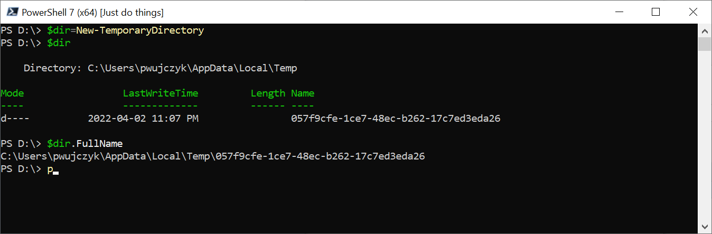

<!--Category:powershell--> 
 

     
    <a href="http://productivitytools.tech/new-temporarydirectory/"><a> 
    

    

# New-TemporaryDirectory

Module creates new directory in the temp folder.
<!--more-->

It uses guid as name of the directory.

